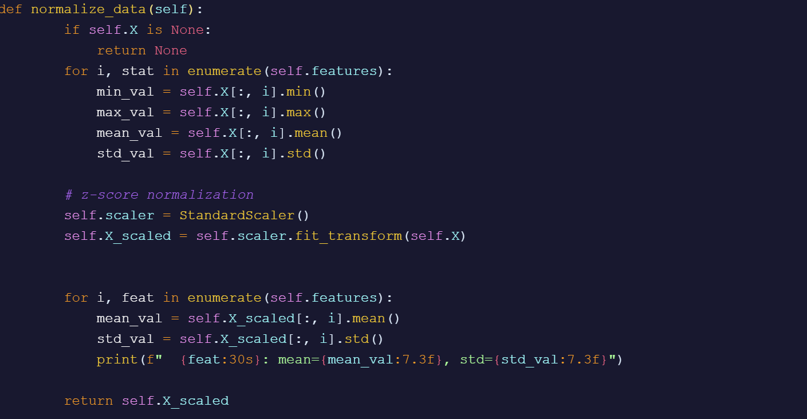
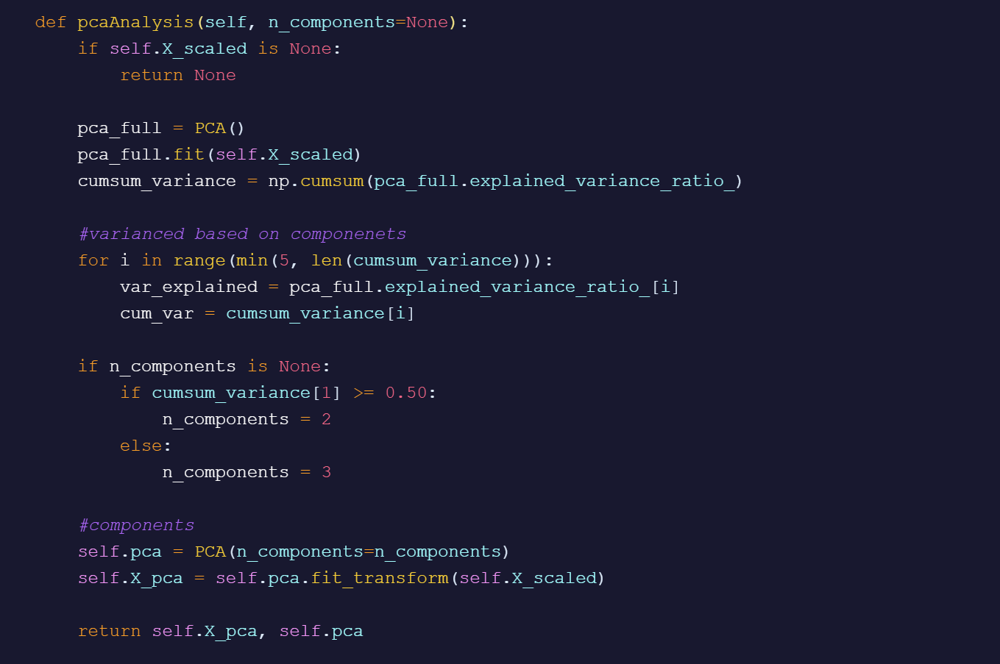
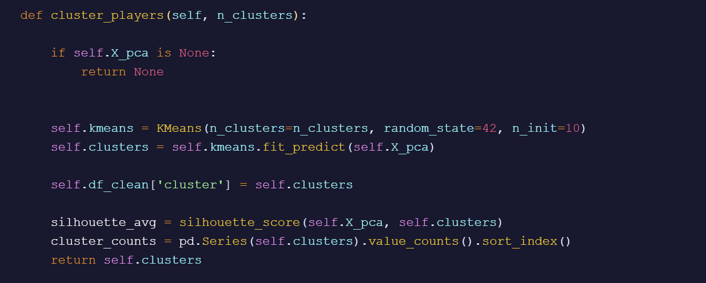
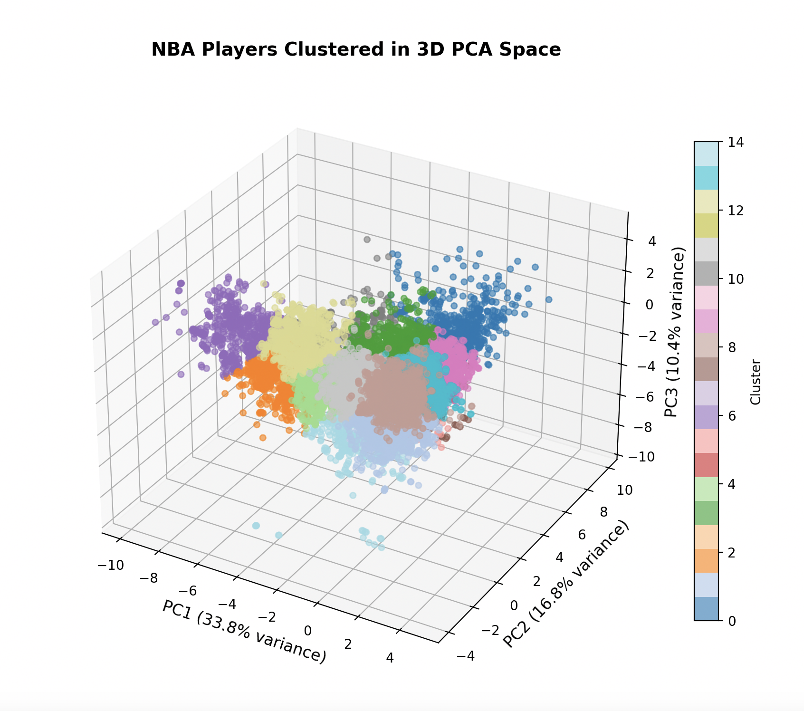
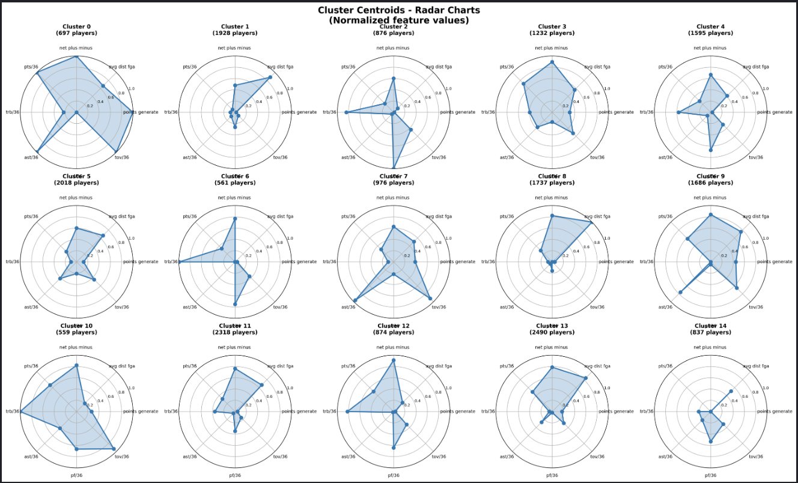
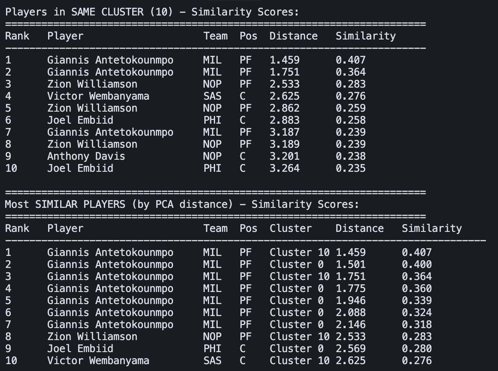

# Dimensionality Reduction and Clustering of NBA Player Statistics Using PCA

**Authors:** Isaac Lehrer, Manas Ramesh  
**Date:** December 2025

## Introduction

Sports players get injured, quit, or otherwise need to be replaced all the time. We aim to provide a solution that reduces the negative impact of these changes by giving teams good alternatives to their lost players. We do this by clustering players into groups with player archetypes. We rely on linear algebra methods, notably principal component analysis (PCA) and vector normalization, to perform our analysis.

## Methodology

### Principal Component Analysis (PCA)

With so many different statistics characterizing each player's worth and contribution to their team, it is impossible to visualize them all in all their dimensionality. To fix this, we rely on PCA, which reduces the dimensionality of our dataset to just 3 dimensions. While some variance is lost in this reduction, PCA can effectively map a significant portion of the high-dimensionality data onto just a few dimensions.

Before doing PCA, we normalized all our statistics so that one statistic isn't disproportionately favored. We used Z-score normalization to accomplish this.



Afterwards, the normalized data was able to be used for PCA. The code used is shown below.



### K-Means / Clustering

Once the data was mapped onto 3 dimensions, our goal was to separate the players into groups with players similar to them. For this, we used a K-means clustering algorithm which separated our data into 15 clusters based on player archetypes. K-means works by iteratively assigning to all data points the nearest cluster (readjusting the center as necessary) until there is no significant movement. Our code is shown below:



## Results

In the PCA, we were able to capture roughly 61% of the variance in 3 dimensions. The plotted data is shown below:



Running the K-means algorithm got us the following clusters:



The clusters reveal distinct archetypes of NBA players based on their statistical profiles. Cluster 0 shows major spikes in points, assists, and points generated, representing primary creators: All-Star guards and wings who drive team offense. Cluster 1 shows a small increase in three-point distance but is otherwise flat, corresponding to low-usage defensive wings who rarely handle the ball. Cluster 2 consists of defensive bigs such as pure centers and rim protectors. Cluster 3 captures balanced big forwards who contribute across multiple areas. Cluster 4 contains traditional role-playing power forwards and centers. Cluster 5 represents balanced two-way guards with moderate contributions in scoring, passing, and defense. Cluster 6 shows strong interior bigs who operate almost exclusively in the paint. Cluster 7 includes small guards who provide playmaking and secondary scoring. Cluster 8 contains wings and forwards who primarily function as spot-up shooters, while Cluster 9 shows guards entirely around shooting volume. Cluster 10 represents elite All-Star bigs—players with high-impact interior scoring, rebounding, and creation (e.g., modern MVP-caliber centers). Cluster 11 features generic scoring forwards who provide offensive value but limited defensive versatility. Cluster 12 consists of high-rebounding centers who score almost exclusively in the paint. Cluster 13 contains 3-level scorers (shooting paint, midrange, and three-pointers) wings capable with some defensive contributions. Finally, Cluster 14 captures low-usage bench wings who provide minimal statistical impact.

Across all archetypes, the most populated clusters were Cluster 5, Cluster 11, and Cluster 13, which collectively represent the league's modern role players. The NBA's shift toward spacing and three-point volume explains the abundance of Cluster 5 guards—role-playing guards today must provide defense and some creation. For forwards, there is more flexibility, which aligns with the large populations in Clusters 11 and 13 that consist mostly of scoring and floor-spacing wings and less emphasis on defense.

Conversely, the least populated clusters were Cluster 6 and Cluster 10, both defined by big-man archetypes. The decline of Cluster 6, the traditional, non-shooting, paint-bound center, is consistent with modern NBA trends that prioritize perimeter defense and spacing. In contrast, Cluster 10 represents the emergence of the new all-encompassing big man, shown by players such as Nikola Jokić and Joel Embiid. This evolution emphasizes how the league has shifted away from the "pure center" of Cluster 6 toward the versatile, star-level bigs that now define Cluster 10.

We were also able to identify statistical outliers by comparing each player to others within their cluster and by measuring PCA distance in the reduced feature space. As shown in Figure 6, we examined players most similar to the 2024–2026 versions of Giannis Antetokounmpo. Within his cluster, the model grouped him with earlier seasons of himself and with players who share similar physical profiles or archetypes. The first player other than Giannis himself is Zion Williamson, another elite interior finisher. However, when comparing PCA distances, we observed a dramatic drop-off in similarity: Zion's PCA similarity to Giannis was far lower (0.407 vs. 0.283 for self-matches).

This difference shows that, despite clustering methods placing them in the same archetype, no current player occupies the same statistical space as Giannis. He is effectively an statistical outlier that no other player replicates.

Thus, our model is capable of detecting "unicorn" players: individuals whose statistical profiles are so unique that they stand alone, even among cluster peers with similar roles.



## Conclusion

We were able to meaningfully group the NBA players into intuitive clusters that capture their value and team contribution. This is an important finding as it can be used to optimize team efficiency, especially in times of injury or trade.

The large cluster sizes show that there are generally a lot of players who can reasonably replace another without heavily changing the team dynamic. This is also important and possibly unexpected.

In the future, we would get more statistics and use multiple PCA to represent offensive, defense, and other advanced statistics.

### Limitations & Future Work

While we were able to meaningful group players with this dataset, there are a few limitations.

1. This dataset is a small subsample of existing NBA statistics. Many trends here may not extrapolate to broader datasets. There is also much more to explore and test.

2. Statistics can not capture some relationships/player dynamics, which limits the efficacy this would have. Future work should focus on capturing some of these less-quantifiable metrics.

3. Players at the extremes are much harder to replace and their clusters do not meaningfully represent them.

## How to Run

```bash
pip install -r requirements.txt
python3 nba_analysis.py
```

## References

1. Datta, S. (2025). NBA Stats (1947-present). Kaggle.com.  
   https://www.kaggle.com/datasets/sumitrodatta/nba-aba-baa-stats?select=Per+36+Minutes

2. McKinney, W. (2010). Data structures for statistical computing in Python. In S. van der Walt & J. Millman (Eds.), Proceedings of the 9th Python in Science Conference (pp. 51–56). Austin, TX: SciPy. https://doi.org/10.25080/Majora-92bf1922-00a

3. Harris, C. R., Millman, K. J., van der Walt, S. J., Gommers, R., Virtanen, P., Cournapeau, D., … Oliphant, T. E. (2020). Array programming with NumPy. Nature, 585(7825), 357–362. https://doi.org/10.1038/s41586-020-2649-2

4. Hunter, J. D. (2007). Matplotlib: A 2D graphics environment. Computing in Science & Engineering, 9(3), 90–95. https://doi.org/10.1109/MCSE.2007.55

5. Pedregosa, F., Varoquaux, G., Gramfort, A., Michel, V., Thirion, B., Grisel, O., … Duchesnay, É. (2011). Scikit-learn: Machine learning in Python. Journal of Machine Learning Research, 12, 2825–2830.
